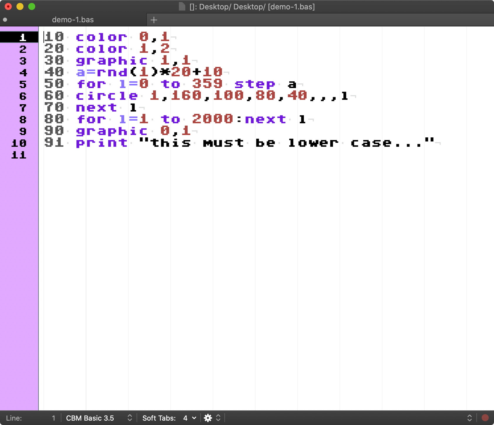

# Commodore 16 Basic Bundle

Are you nuts like me? Do you still love Commodore 16 or Plus4 ? and use
TextMate ? This is a small bundle that makes you feel using real Commodore 16
or Plus4 basic on you mac!



---

# Requirements

**C64 Pro Mono** font by **STYLE**

Download [zip][font] and extract `C64_Pro_Mono-STYLE.ttf` to `~/Library/Fonts/`

---

# Installation

```bash
$ cd ~/Library/Application\ Support/TextMate/Bundles/
$ git clone https://github.com/vigo/c16-basic.tmbundle.git
```

If you don’t have `~/.tm_properties` create via;

```bash
$ touch ~/.tm_properties
```

Then add or append lines below:

```ini
[ source.cbm35.bas ]
theme = FDA2C2D9-E5EA-480E-B4B7-846A25DEC7DD
fontName = "C64ProMono"
```

Now restart TextMate!

---

## Contribute

PR’s are very welcome!

1. `fork` (https://github.com/vigo/c16-basic.tmbundle/fork)
2. Create your `branch` (`git checkout -b my-features`)
3. `commit` yours (`git commit -am 'added killer features'`)
4. `push` your `branch` (`git push origin my-features`)
5. Than create a new **Pull Request**!

---

## Contributer(s)

* [Uğur "vigo" Özyılmazel][vigo] - Creator, maintainer

***

## License

This project is licensed under MIT.

[vigo]:  https://ugur.ozyilmazel.com "Official Homepage"
[font]: https://style64.org/file/C64_TrueType_v1.2.1-STYLE.zip "C64 Pro Mono font"